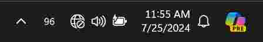
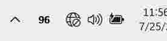
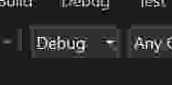

# percentage

See your battery percentage in the Windows 10/11 system tray/notification area

## Fork

This fork has additional features
- Light theme support (text can be shown in black color)

   
- Updated .NET from 4.5.2 to .NET Core 8.0 LTS
- meant to be used alongside normal icon, so disabled charging icon ( `96*` -> `96` )
- starting up a lot faster

## Installing

<!-- 1. [Download the latest release](https://github.com/filipkruza/percentage/releases) -->
1. Build program
1. Get to your startup folder (press `Windows`+`R`, type `shell:startup`) and put program there

## Compiling

This project was compiled with Visual Studio 2022.

Select ".NET desktop development" when setting up Visual Studio.

To build the project
1. Open the percentage/percentage.sln file with Visual Studio
1. Switch Debug to Release

   

1. Click "Build > Build Solution"
1. percentage can be found at `src\bin\Release\`

## Contributions

> My goal for this project is to keep it as simple as possible. I welcome suggestions, but for complicated features I'd recommend forking the project.

Original goal remains the same
